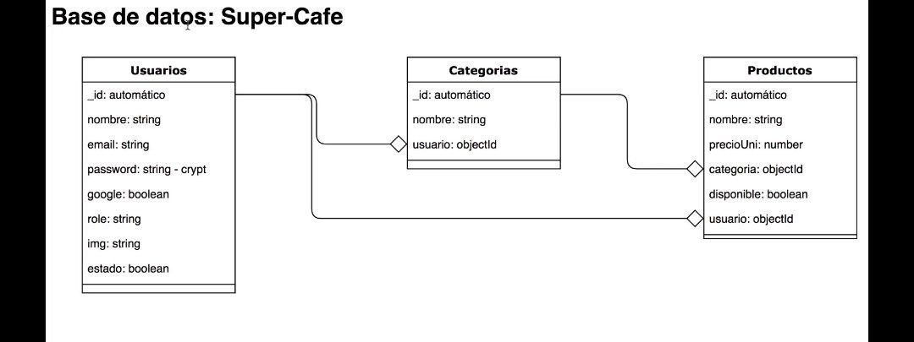

# RestServer con Express

## 1. Primero debemos de inicializar el proyecto con "npm init -y". Esto nos creará un archivo llamado package.json ( lugar donde tendremos nuestra configuración de nuestra app y dar seguimiento a sus paquetes externos)

```bash
- npm install express dotenv cors
- npm install -D nodemon
```

- Para correr necesitamos crear un main.js ( no importa si solo tiene un console.log("algún mensaje"))

```bash
 node main.js
```

## 2. Models (lugar donde tendremos el esqueleto de nuestra aplicación en forma de clase)

```js
import express from "express";

class Server {
  constructor() {
    this.app = express();
    this.port = process.env.PORT || 5050;

    // middlewares
    this.middlewares();
    // routes
    this.routes();
  }
  middlewares() {
    this.app.use(express.static("public"));
  }

  routes() {
    this.app.get("/api", (req, res) => {
      res.send("cague de rii");
    });

    this.app.post("/api", (req, res) => {
      res.json({
        message: "post API",
      });
    });

    this.app.put("/api", (req, res) => {
      res.json({
        message: "put API",
      });
    });

    this.app.patch("/api", (req, res) => {
      res.json({
        message: "Patch API",
      });
    });

    this.app.delete("/api", (req, res) => {
      res.json({
        message: "delete API",
      });
    });
  }

  listen() {
    this.app.listen(process.env.PORT, () => {
      console.log(`the application listening in the port ${process.env.PORT}`);
    });
  }
}

export default Server;
```

## 3. Algunas deficiones

- Middlewares: son funcionalidades que le damos a nuestra aplicación para realizar una acción.
- routes: El método o archivo que se encargará de tener las rutas de nuestra aplicación.
- listne: método que se encargará de levantar el servidor.

## 4. CORS

- Los Cors es un middleware que exige los navegadores para que el frontend o cualquier otro usuario pueda tener permiso a ver nuestra información que mandamos desde el servidor.
- Más info: https://www.npmjs.com/package/cors

## 5. Lectura del body

- Primero lo que debemos hacer es agregar un nuevo middleware

```js
this.app.use(express.json());
```

- Luego en el controlador donde tenemos acceso al request y response, podemos consumir el valor del body que viene adentro del request.

```js
// controllers/user.js
const userPost = (req, res) => {
  const body = req.body;
  res.json({
    message: "post API",
    ...body,
  });
};
```

## 6. Segmentos (parametros en las rutas)

- Los segmentos lo podemos ver como variables en los parámetros y adentro de la request (req.params) vendrá los parámetros y express ya lo parse.

```js
// user route
router.put("/:id", userPut);

// user controller
const userPut = (req = request, res) => {
  const { id } = req.params;

  res.json({
    message: "put API",
    id,
  });
};
```

## 7. Query Params

- Los query params son como si fuesen unos filtros en nuestras rutas y esto van a ser opcionales. Express ya lo parsea y la podemos usar. NO TENEMOS QUE AGREGAR NADA EN NUESTRAS RUTAS.

```js
const userGet = (req = request, res = response) => {
  const query = req.query;
  // path: http://localhost:8080/api/users?name=jeje&limit=10
  res.json({
    message: "get all :D",
    ...query,
  });
};
```

## 8. Conexión con la database (MONGO - mongoose)

```bash
npm install mongoose
```

- Configuración de la DB

```js
// database/config.js
const mongoose = require("mongoose");

const connectDB = async () => {
  try {
    await mongoose.connect(process.env.MONGO_CNN);
    console.log("mongo conectado :D");
  } catch (error) {
    console.log(error);
    throw new Error("Error en la conexión de la base de datos...");
  }
};

module.exports = {
  connectDB,
};
```

## Diagrama de flujo del proyecto



## 9. Creación de nuestro modelo User

```js
const { Schema, model } = require("mongoose");

const UserSchema = Schema({
  name: {
    type: String,
    required: [true, "the name is require"],
  },
  email: {
    type: String,
    required: [true, "the email is require"],
  },
  password: {
    type: String,
    required: [true, "the password is require"],
  },
  img: {
    type: String,
  },
  rol: {
    type: Boolean,
    required: true,
    enum: ["ADMIN_ROLE", "USER_ROLE"],
  },
  state: {
    type: Boolean,
    default: false,
  },
  google: {
    type: Boolean,
    default: false,
  },
});

module.exports = model("User", UserSchema);
```

- El schema es como le decimos que se tiene que comportar nuestra entidad, tipo, si es requerido, valores por defaults, etc. Y claro, nombre de los campos del modelo a crear.
- El model, recibe dos parámetros, el primero es como vamos a nombrar a nuestro modelo. Por cierto, el nombre debería de estar en singular, mongoose ya se encarga de agregarle la "s" ó plurarizar nuestro modelo en la base de datos. Como segundo parámetro recibe a nuestro schema.

## 10. Guardar un usuario en nuestra DB.

```js
// controller/user.js  (method post)

const Usuario = require("../models/user");

const userPost = async (req, res) => {
  const body = req.body;
  const usuario = new Usuario(body);
  console.log(usuario);

  await usuario.save();

  res.json({
    message: "post API",
    usuario,
  });
};
```

## 11. Encryptar la password

```bash
npm install bcryptjs
```

```js
const bcryptjs = require("bcryptjs");

const userPost = async (req, res) => {
  const { password, name, email, rol } = req.body;
  const usuario = new Usuario({ password, name, email, rol });

  // ver si el email existe

  // encryptar el password
  const salt = bcryptjs.genSaltSync();
  usuario.password = bcryptjs.hashSync(password, salt);

  // guardar el password en nuestra DB
  await usuario.save();

  res.json({
    message: "post API",
    usuario,
  });
};
```

## 12. Validar Campos

```bash
npm i express-validator
```

- Primero debemos de validar con una simple función y ayuda del método del findOne de nuestro modelo para ver si existe ya el email.

```js
// Esto está adentro del controlador del userPost
// ver si el email existe
const existEmail = await Usuario.findOne({ email });
if (existEmail) {
  return res.status(400).json({ message: "the email already exists" });
}
```

- Luego, para hacer la validación con ayudar nuestra libreria de express-validator, tenemos un middleware que nos ayudará a realizar este trabajo. Cabe mencionar que esto se encuentra en las rutas. Si bien, las rutas recibe dos parámetros, pero puede recibir un tercero, y este irá antes del controllador. Esto middleware será nuestra validación y no llegará al controlador a menos que sea válido por nuestra el validator.

```js
// routes/users.js
const { check } = require("express-validator");

router.post("/", [check("email", "the email is invalid").isEmail()], userPost);
```

- Esta validación se quedarán guardadas en un entorno y no se mostrarán hasta que le indiquemos.

```js
const { validationResult } = require("express-validator");
const errors = validationResult(req);
if (!errors.isEmpty()) {
  return res.status(400).json(errors);
}
```

## 13. Mas validaciones y validationField (customValidation)

```js
// middlewares/validationField.js
const { validationResult } = require("express-validator");

const validationFields = (req, res, next) => {
  const errors = validationResult(req);
  if (!errors.isEmpty()) {
    return res.status(400).json(errors);
  }
  next();
};

module.exports = {
  validationFields,
};
```

- Este custom validation va a ser el último middleware que se va a ejecutar antes de entrar en el controller. Ya, que esta función va a recopilar todos los errores que obtenga desde las validaciones (middlewares) anteriores.

## 14. Validando el Role si eiste en la base de datos.

- Primero vamos a nuestra DB y creamos una nueva tabla. En este caso se llamará "roles", le agregamos un documento

```js
{
  "role": "ADMIN_ROLE"
}
```

- Hacemos esto por veces más, para (USER_ROLE, VENTAS_ROLE).Esto hará que ahora tengamos una entidad nueva llamada roles con 3 documentos (3 entidades)

- En nuestro proyecto de node, vamos a crear un modelo Role, entonces comencemos creando la Schema para dicha acción.

```js
// models/role.js
const { Schema, model } = require("mongoose");

const RoleSchema = Schema({
  role: { type: String, required: [true, "the role is require"] },
});

module.exports = model("Role", RoleSchema);
```

- Volvamos a nuestras rutas para seguir la validación.

```js
  check("rol").custom(async (role = "") => {
      const existRole = await Role.findOne({ role });
      if (!existRole) {
        throw new Error("Role doesn't exist in the database");
      }
    }),
```

## 15. Eliminando el password de nuestra respuesta json

```js
// models/user.js
User.methods.toJSON = function () {
  const { __v, password, ...usuario } = this.toObject();
  return usuario;
};
```

## 16. Custom Validación.

- las custom validación, son como dice su nombre, validaciones creadas por nosotros. Para ello, nos vamos a ayudar del método custom que tiene nuestr express-validator.

- Creamos nuestro carpeta helpers

```js
const isValidEmail = async (email) => {
  console.log({ email });
  const existEmail = await Usuario.findOne({ email });
  if (existEmail) {
    throw new Error("The email address is already");
  }
};
// exportamos el isValidEmail
```

- En las rutas vamos antes de entrar al controlador, vamos a colocar nuestro custom validación.

```js
router.post(
  "/",
  [
    check("name", "The name is require").not().isEmpty(),
    check("password", "The password is require and could be more 6 characters")
      .not()
      .isEmpty()
      .isLength({ min: 6 }),
    check("email").custom(isValidEmail),
    // check("rol", "The rol is invalid").isIn(["ADMIN_ROLE", "USER_ROLE"]),
    check("rol").custom(isValidRole),
    validationFields,
  ],
  userPost
);
```

## 17. GET usuarios

- Trear todos los usuarios.

```js
// controller/user.js
const userGet = async (req = request, res = response) => {
  const { limit = 5, from = 0 } = req.query;
  // path: http://localhost:8080/api/users?limit=5&from=5
  const usuarios = await Usuario.find().limit(Number(limit)).skip(Number(from));
  res.json({
    message: "get all :D",
    usuarios,
  });
};
```

## 18. enviar el total y refactorizando el código de GET

```js
const userGet = async (req = request, res = response) => {
  const { limit = 5, from = 0 } = req.query;
  // path: http://localhost:8080/api/users?limit=5&from=5
  const usuarios = await Usuario.find({ state: false })
    .limit(Number(limit))
    .skip(Number(from));
  const total = await Usuario.countDocuments({ state: false }); // aqui debería ser true por un filtrado, es opcional

  res.json({
    total,
    usuarios,
  });
};
```

- refactorizando el Código

```js
const userGet = async (req = request, res = response) => {
  const { limit = 5, from = 0 } = req.query;
  // path: http://localhost:8080/api/users?limit=5&from=5
  // const usuarios = await Usuario.find({ state: false })
  //   .limit(Number(limit))
  //   .skip(Number(from));
  // const total = await Usuario.countDocuments({ state: false }); // aqui debería ser true

  const [total, usuarios] = await Promise.all([
    Usuario.countDocuments({ state: false }),
    Usuario.find({ state: false }).limit(Number(limit)).skip(Number(from)),
  ]);
  res.json({
    total,
    usuarios,
  });
};
```

## 19. Delete User.

```js
const userDelete = async (req, res) => {
  const { id } = req.params;

  const usuario = await Usuario.findByIdAndDelete(id);

  res.json({
    message: `delete user with id: ${id}`,
  });
};
```

## 20. Update User

```js
// controller/user.js

export const userPut = async (req = request, res) => {
  const { id } = req.params;
  const { _id, password, google, ...resto } = req.body;

  if (password) {
    const salt = await bcrypt.genSaltSync();
    resto.password = await bcrypt.hashSync(password, salt);
  }

  const user = await User.findByIdAndUpdate(id, resto);
  await user.save();

  res.json({
    message: "Put user",
    ...resto,
  });
};

// Validation in the route
// routes/user.js
router.put(
  "/:id",
  [
    check("id", "Is invalid the id").isMongoId(),
    check("id", "don't exist user with this id").custom((id) =>
      existUserById(id)
    ),
    validationField,
  ],
  userPut
);

// helper para la custom existUserById
export const existUserById = async (id) => {
  const existUser = await User.findById(id);
  if (!existUser) {
    throw new Error("the user does not exist");
  }
};
```
